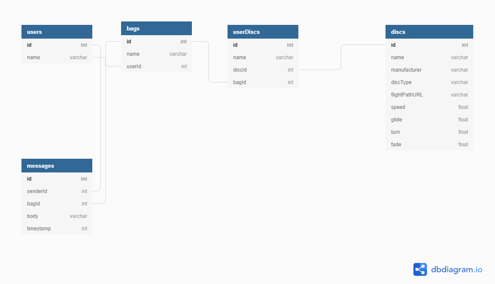

# In the Bag

In the Bag is a simple, lightweight application for building virtual disc golf bags. It is designed so that new players or clubs catering to new players can access disc flight information and comment on each other's bags without the overwhelming clutter of other disc golf web apps. A user may build a virtual bag, populate it with discs, review these discs' flight statistics and projected flight paths in real time as they browse discs, and add these discs to their bags. They may also review bags and discs of other users and view the flight information of their discs with a simple click.

## Required Resources

To run this application, the user will need to install [Node.js and NPM](https://nodejs.org/en/download/).

This proof-of-concept uses json-server to establish a mock REST API to simulate external data, so after installing NPM the user will need to execute this command in the terminal: `npm i -g serve json-server`

## To Run application:

Open a terminal window and navigate to the project API folder. Execute this command to serve the application data on port 8088: `json-server -p 8088 -w db.json`

Likewise, in a separate terminal window, execute this command to serve the disc database on port 5000: `json-server -p 5000 -w discDB.json`

Finally, navigate another terminal session to the project's root folder and execute the command `npm start` to run a React session in the browser via port 3000.

## ERD

## WireFrame

Initial layout sketches for In the Bag:

